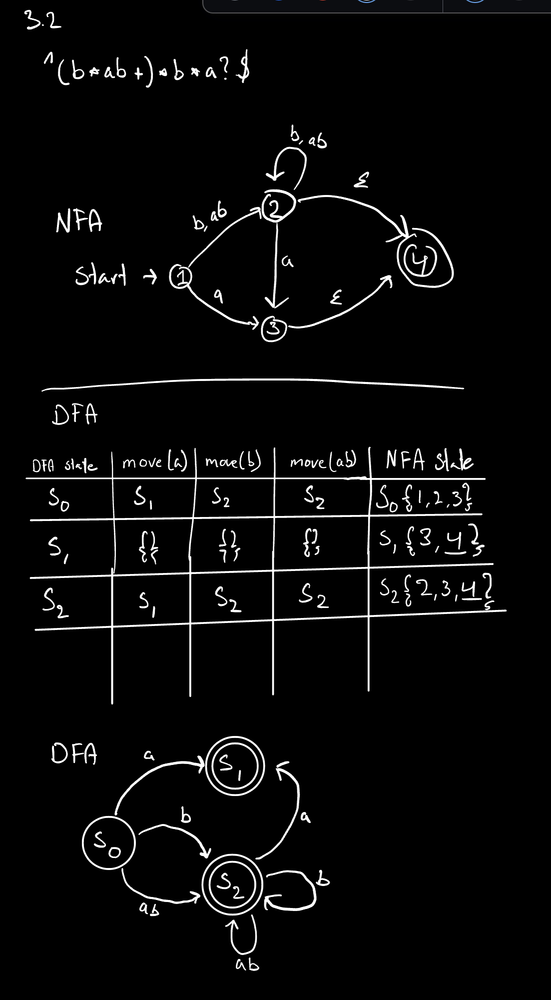

## 2.1
```
        T
       /|\
      a T c
       /|\
      a T c
        |
        R
       /|\
      R b R
     /|\   \
    R b R   E
   /|\   \
  R b R   E
 /     \
E       E
```
## 2.2
```
grammar 2.9
T -> R
T -> aTc
R -> 
R -> bR

aabbbcc
    T
=>  aTc
=>  aaTcc
=>  aaRcc
=>  aabRcc
=>  aabbRcc
=>  aabbbRcc
=>  aabbbcc
        T
       /|\
      a T c
       /|\
      a T c
        |
        R
       / \
      b   R
         / \
        b   R
           / \
          b   R
               \
                E
```

## 3.2



## HelloLex Question

### Q1

Recognizes numbers (as chars) between 0-9

Matching digits ('0' to '9') and associating them with their corresponding text value.

Catching any other character and raising a lexer error with an error message.

### Q2.1

hello.fs

### Q2.2

3 states

### Q3

hello.exe has ben generated

### Q4

hello2.exe has ben generated

### Q5

hello3.exe has ben generated